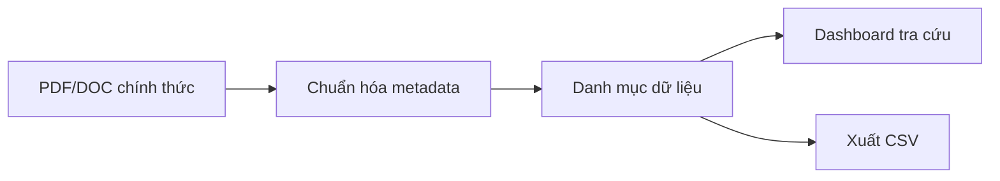

<div align="center">

# 🧩 BigMath — Bản đồ Bài toán lớn Việt Nam

**Kho dữ liệu mở để lưu trữ, thống kê và tra cứu các bài toán lớn về khoa học, công nghệ, đổi mới sáng tạo và chuyển đổi số.**

[](#-phạm-vi-dữ-liệu)
[](#-kho-văn-bản)
[](#-phạm-vi-dữ-liệu)
[](https://base27-cvnss.github.io/bigmath/)
[](https://github.com/Base27-CVNSS/bigmath/actions/workflows/validate.yml)
[](LICENSE)

[🌐 Mở dashboard](https://base27-cvnss.github.io/bigmath/) · [📄 Xem kho văn bản](documents/) · [🧭 Phương pháp dữ liệu](#-phương-pháp-thống-kê)

</div>

---

## 🎯 BigMath là gì?

BigMath biến các phụ lục PDF/DOC dài và khó tra cứu thành một **danh mục dữ liệu có cấu trúc**. Người dùng có thể tìm kiếm theo tên bài toán, cơ quan, địa phương, năm, lĩnh vực; xem phân bố thống kê; mở văn bản gốc; hoặc xuất kết quả đang lọc ra CSV.

Tên “BigMath” ở đây mang nghĩa **Big Problems** — các bài toán phát triển quy mô lớn cần huy động khoa học, công nghệ, đổi mới sáng tạo và chuyển đổi số để giải quyết.

> [!IMPORTANT]
> Dashboard là công cụ tra cứu độc lập. Tệp PDF/DOC của cơ quan ban hành là nguồn có giá trị đối chiếu. Nhãn lĩnh vực trên website chỉ phục vụ tìm kiếm, không thay thế phân loại pháp lý hoặc nội dung chính thức.

## ✨ Chức năng nổi bật

- 🔎 Tìm kiếm tiếng Việt không phụ thuộc dấu theo tên, đơn vị, lĩnh vực và địa phương.
- 🧭 Lọc đồng thời theo nguồn văn bản, năm ban hành và lĩnh vực.
- 📊 Thống kê phân bố giữa 2 Bộ và 9 tỉnh, thành phố.
- 🧾 Tổng hợp 125 trang kiểm tra và hiển thị ngày cập nhật dữ liệu ngay trên dashboard.
- 🗂️ Liên kết trực tiếp từng dòng dữ liệu với văn bản PDF/DOC tương ứng.
- 🔐 Công bố SHA-256, dung lượng và tên gốc trong manifest để kiểm tra tính toàn vẹn.
- ⭐ Tách riêng 8 bài toán ưu tiên của An Giang để tránh cộng trùng.
- ⇩ Xuất danh sách sau khi lọc thành CSV UTF-8, mở tốt trong Excel.
- 📱 Giao diện responsive, hỗ trợ bàn phím và chế độ giảm chuyển động.
- 📴 Không dùng framework hoặc thư viện biểu đồ bên ngoài; có thể mở cục bộ.

## 📊 Phạm vi dữ liệu

| Cấp | Cơ quan/địa phương | Văn bản | Bài toán chính | Ưu tiên riêng |
|---|---|---:|---:|---:|
| 🏛️ Bộ ngành | Bộ Khoa học và Công nghệ | 1144/QĐ-BKHCN | 21 | — |
| 🌿 Bộ ngành | Bộ Nông nghiệp và Môi trường | 3410/QĐ-BNNMT | 15 | — |
| 🌆 Địa phương | Thành phố Hồ Chí Minh | 3572/UBND-KT | 14 | — |
| 🌾 Địa phương | Tỉnh Vĩnh Long | 3552/UBND-VX | 9 | — |
| 🌉 Địa phương | Thành phố Cần Thơ | 1424/QĐ-UBND | 12 | — |
| 🌊 Địa phương | Tỉnh An Giang | 259/TB-UBND | 20 | 8 |
| 🏔️ Địa phương | Tỉnh Yên Bái | 1083/QĐ-UBND | 15 | — |
| 🏛️ Địa phương | Tỉnh Vĩnh Phúc | 1148/QĐ-CT | 12 | — |
| 🏙️ Địa phương | Thành phố Hà Nội | 1193/QĐ-UBND | 30 | — |
| 🌱 Địa phương | Tỉnh Đắk Lắk | 1269/QĐ-UBND | 8 | — |
| 🤖 Địa phương | Tỉnh Tây Ninh | 2592/KH-UBND | 1 | — |
| **Tổng** | **11 nguồn** | **7 PDF + 4 DOC** | **157** | **8** |

Tổng **157** gồm các dòng thuộc danh mục chính và một bài toán được nêu trực tiếp trong tiêu đề Kế hoạch 2592/KH-UBND của Tây Ninh. Tám mục ở Phụ lục 2 của An Giang được hiển thị trong khu vực “ưu tiên đặt hàng” nhưng không cộng thêm vào tổng chính. Hai tệp Vĩnh Phúc do người dùng cung cấp có SHA-256 giống nhau nên kho chỉ giữ một bản.

## 🧠 Bản chất dữ liệu



Mỗi bản ghi chính lưu các trường cốt lõi: mã nội bộ, số thứ tự trong phụ lục, năm, nguồn, cơ quan/địa phương, đơn vị chủ trì hoặc đề xuất, nhãn lĩnh vực tham khảo và nguyên văn tên bài toán.

## 🗂️ Kho văn bản

Các tệp được chia theo cấp quản lý và đổi tên theo quy ước nhất quán:

```text
documents/
├── bo-nganh/
│   ├── bo-khoa-hoc-va-cong-nghe/
│   └── bo-nong-nghiep-va-moi-truong/
└── dia-phuong/
    ├── tinh-an-giang/
    ├── tinh-dak-lak/
    ├── tinh-tay-ninh/
    ├── tinh-vinh-phuc/
    ├── tinh-vinh-long/
    ├── tinh-yen-bai/
    ├── tp-can-tho/
    ├── tp-ha-noi/
    └── tp-ho-chi-minh/
```

Quy ước tên tệp:

```text
YYYY-MM-DD_LOAI-SO-COQUAN_noi-dung-ngan-gon.{pdf|doc}
```

Ví dụ:

```text
2026-04-06_QD-1424-QD-UBND_danh-muc-bai-toan-lon-dot-1.pdf
```

Xem [bảng kiểm kê và ánh xạ tên tệp](documents/README.md) để biết tên gốc, tên mới, số trang và phạm vi từng văn bản. Tệp [`documents/manifest.json`](documents/manifest.json) cung cấp metadata máy đọc được cùng mã SHA-256 của từng tệp.

## 📦 Truy cập dữ liệu

| Tài nguyên | Định dạng | Mục đích |
|---|---|---|
| [Dashboard](https://base27-cvnss.github.io/bigmath/) | HTML | Tra cứu, lọc, thống kê và xuất CSV |
| [`assets/data.js`](assets/data.js) | JavaScript | 157 bản ghi chính, 8 mục ưu tiên và metadata 11 văn bản |
| [`documents/manifest.json`](documents/manifest.json) | JSON | Ánh xạ tên gốc - tên chuẩn, dung lượng và SHA-256 |
| [`documents/README.md`](documents/README.md) | Markdown | Bảng kiểm kê dễ đọc và nguyên tắc lưu trữ |

## 🚀 Chạy cục bộ

Không cần cài framework. Do trình duyệt có thể giới hạn một số thao tác khi mở bằng `file://`, nên dùng một máy chủ tĩnh nhỏ:

```bash
git clone https://github.com/Base27-CVNSS/bigmath.git
cd bigmath
python -m http.server 8080
```

Mở `http://localhost:8080`.

## 🌐 Xuất bản GitHub Pages

Sau khi nhánh thay đổi được hợp nhất vào `main`:

1. Mở **Settings → Pages** trong kho GitHub.
2. Ở **Build and deployment**, chọn **Deploy from a branch**.
3. Chọn nhánh `main`, thư mục `/ (root)`, rồi **Save**.
4. Website sẽ có địa chỉ: `https://base27-cvnss.github.io/bigmath/`.

## 🧭 Phương pháp thống kê

1. **Xác minh văn bản:** đọc số, ngày, cơ quan ban hành, định dạng, số trang và cấu trúc phụ lục.
2. **Bóc tách danh mục chính:** mỗi dòng đánh số trong danh mục chính được tính là một bài toán.
3. **Giữ nguyên tên:** tiêu đề bài toán bám theo nội dung PDF/DOC; chỉ chuẩn hóa khoảng trắng và lỗi ngắt trang khi cần.
4. **Tách ưu tiên:** phụ lục ưu tiên của An Giang được lưu riêng để không làm sai tổng chính.
5. **Gắn nhãn tham khảo:** lĩnh vực được thêm để hỗ trợ lọc, không phải thuộc tính pháp lý.
6. **Liên kết nguồn:** mỗi bản ghi luôn trỏ lại tệp gốc đã lưu trong kho.

## 🏗️ Cấu trúc mã nguồn

```text
bigmath/
├── index.html              # Giao diện dashboard
├── assets/
│   ├── app.js              # Tìm kiếm, lọc, biểu đồ và xuất CSV
│   ├── data.js             # 157 bản ghi chính + 8 mục ưu tiên
│   ├── favicon.svg         # Biểu tượng website
│   └── styles.css          # Hệ thống thiết kế responsive
├── documents/              # Kho PDF/DOC + manifest kiểm tra toàn vẹn
├── scripts/validate.mjs    # Kiểm định metadata, liên kết và checksum
├── .github/workflows/      # Kiểm định tự động khi cập nhật
├── .nojekyll               # Phục vụ GitHub Pages trực tiếp
├── LICENSE                 # MIT cho phần mã nguồn
└── README.md
```

## 🤝 Bổ sung văn bản mới

Khi thêm một Bộ, ngành hoặc địa phương:

1. Xác minh PDF/DOC và cơ quan ban hành.
2. Đặt tệp vào đúng nhánh thư mục, theo [quy ước lưu trữ](documents/README.md).
3. Thêm metadata văn bản và các dòng danh mục vào `assets/data.js`.
4. Kiểm tra tổng số, liên kết PDF, bộ lọc và CSV.
5. Ghi rõ cách xử lý nếu văn bản có danh mục phụ, danh mục ưu tiên hoặc dòng trùng.
6. Chạy kiểm định trước khi gửi thay đổi:

```bash
node scripts/validate.mjs
```

Trình kiểm định đối chiếu tổng số bản ghi, số thứ tự theo từng nguồn, đường dẫn, cấu trúc thư mục, dung lượng và SHA-256 của toàn bộ tệp nguồn.

## ⚖️ Bản quyền và nguồn

- Phần mã HTML/CSS/JavaScript của dự án được phát hành theo [MIT License](LICENSE).
- Các PDF/DOC là văn bản của cơ quan nhà nước tương ứng; dự án lưu bản sao để tra cứu và giữ nguyên thông tin nguồn.
- Khi sử dụng cho hồ sơ, nghiên cứu hoặc quyết định chính thức, cần kiểm tra lại văn bản trên cổng thông tin của cơ quan ban hành.

---

<div align="center">

**BigMath · Biến phụ lục tĩnh thành dữ liệu có thể tìm kiếm**

Được duy trì tại [Base27-CVNSS/bigmath](https://github.com/Base27-CVNSS/bigmath)

</div>
